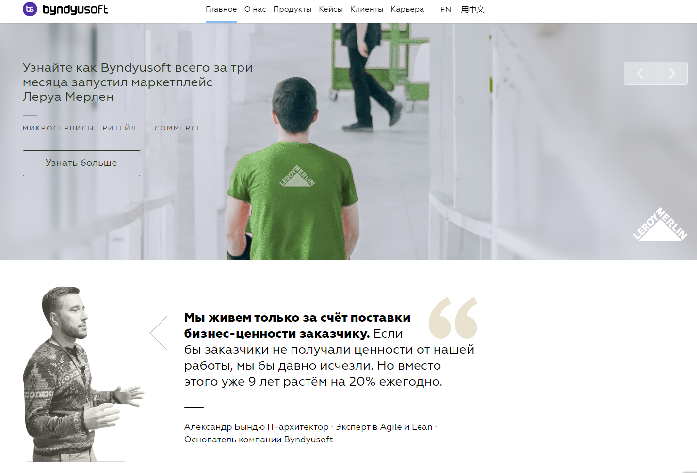

# Проект по автоматизации сайта  [byndyusoft](https://byndyusoft.com/)
**аккредитованная IT компания byndyusoft**
&nbsp;

&nbsp;

## 🧰: Технологии и инструменты

## 🚀: Реализованные проверки

Набор тест-кейсов функционала перехода на страницы, функционала работы с отзывами.

Примеры автоматизированных кейсов:

Тест 1

- ✓ _Переход на сайт byndyusoft_
- ✓ _Наведение на всплывающее меню_
- ✓ _Нажатие на кнопку "Аналитика продукта"_
- ✓ _Переход на страницу "Аналитика продукта"_
- ✓ _Проверка данных на странице_

Тест 2
- ✓ _Переход на сайт byndyusoft_
- ✓ _Наведение на всплывающее меню_
- ✓ _Нажатие на кнопку "калькулятор доставки"_
- ✓ _Переход на страницу "калькулятор доставки"_
- ✓ _Проверка наличия кейса на OZON.ru_-

Тест 3
- ✓ _Переход на сайт byndyusoft_
- ✓ _Наведение на всплывающее меню_
- ✓ _Нажатие на кнопку "Онлайнизатор продаж"_
- ✓ _Переход на страницу "Онлайнизатор продаж"_
- ✓ _Нажатие на "Переход ритейлера автозапчастей на продуктовую разработку и микросервисы"_
- ✓ _Проверка наличие указания директора фирмы Романа Алябьева_

## </a> Jenkins <a target="_blank" href="https://https://jenkins.autotests.cloud/job/byndyusoft_tests/"> job </a>

### 🧙: Параметры сборки в Jenkins:

:yum: BROWSER (браузер, по умолчанию chrome)

:zany_face: BROWSER_VERSION (версия браузера, по умолчанию 100.0)

:smirk: BROWSER_SIZE (размер окна браузера, по умолчанию 1920x1080)

:relieved: SELENOID_URL (выбор url для теста)

:woozy_face: VIDEO_URL (выбор url для видео)

